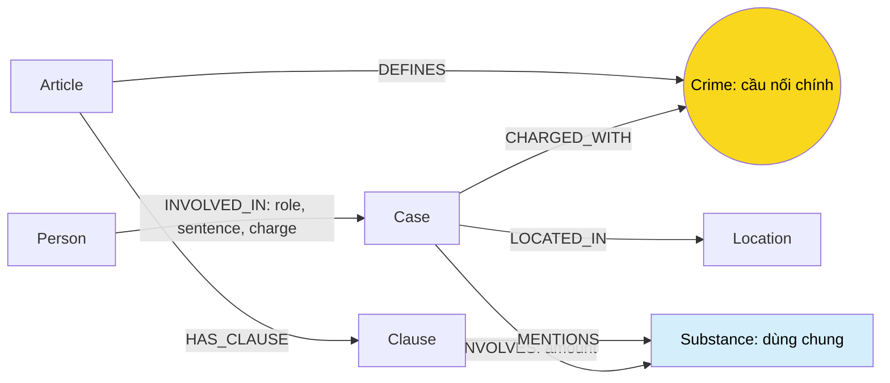

# Thiết kế Ontology — Day 19

**Họ tên:** …  **MSSV:** …

**Lựa chọn**:
- [x] Dùng ontology gợi ý (có thể chỉnh nhỏ)
- [ ] Tự thiết kế (xét bonus +15, xem `SUBMISSION.md`)

Giữ 7 label và 7 relationship trong `src/graph.py`. KB luật cung cấp điều, khoản, tội danh và khung hình phạt; KB tin cung cấp người, vụ, chất, địa điểm và mức án thực tế. Crime nối hai KB, Substance hỗ trợ đối chiếu chất và tổng hợp vụ. Đây là thiết kế cho corpus lab, không xác nhận hiệu lực pháp luật hiện tại.

**Dữ liệu đã đọc:** Điều 251; bốn bài tiêu biểu `news-100260917203001265.md` (Cái Quang Huy), `news-100260918080821054.md` (Lê Minh Thành), `news-100260928173914514.md` (hơn 36kg), `news-100260924105118645.md` (Viện Pháp y tâm thần); benchmark Q1–Q6; template; graph.py; LAB_GUIDE và SUBMISSION. Đọc thêm bài `news-100260925144412498.md` về Hoàng Nato, Điều 2 Luật PCMT và khoản cao nhất Điều 250/255 để đối chiếu benchmark.

**Trạng thái:** đã triển khai KG-1..KG-4, giữ topology và khóa định danh của thiết kế. Chưa chạy test/build/benchmark hoặc Cypher thực tế; đã review source tĩnh. Các truy vấn chỉ đọc để thử thủ công có trong [CYPHER_KG3.md](CYPHER_KG3.md).

## 1. Sơ đồ



Điều giải thích từ ngữ vẫn có Article → Clause dù không định nghĩa Crime. Không ép “tiền chất” thành tội danh để trả lời Q1.

### Entity quan sát được

| Nguồn | Entity/khái niệm xuất hiện | Biểu diễn |
| --- | --- | --- |
| Luật Điều 251 | BLHS; Điều 251; khoản 1–5; mua bán trái phép chất ma túy | Article.law, Article, Clause, Crime |
| Luật Điều 251 | Heroine, Cocaine, Methamphetamine, Amphetamine, MDMA, XLR-11; nhựa thuốc phiện/nhựa cần sa/cao côca; cây côca, lá khát, cần sa; quả thuốc phiện khô/tươi; chất khác thể rắn/lỏng | Substance cho tên chuẩn trong HINT; giữ dạng chế phẩm, nhóm chất và điều kiện đầy đủ trong Clause.text |
| Luật Điều 251 | Người phạm tội, người dưới 16 tuổi, cơ quan/tổ chức; mức tù, tiền phạt, khối lượng/thể tích | Điều kiện và chế tài trong Clause.text/penalty; không tạo Person cho nhóm người chung |
| Luật đối chiếu | Điều 250: vận chuyển trái phép chất ma túy; Điều 255: tổ chức sử dụng trái phép chất ma túy; Điều 2 Luật PCMT: tiền chất | Article, Clause; Crime khi tiêu đề là “Tội …”; tiền chất giữ trong text khoản 4 |
| Tin Cái Quang Huy | Cái Quang Huy, Nguyễn Tiến Đạt, Nguyễn Hữu Đức; “Bốp Bốp Huy”; MDMA, Ketamine; Hà Nội, Nội Bài, Berlin/Đức, Nghệ An | Person/aliases, Case, Crime, Substance, Location chính; tuyến đường trong summary |
| Tin Lê Minh Thành | Lê Minh Thành, Trịnh Vũ Kiên, Kim Xuân Tuấn, Nguyễn Quang Hưng; MDMA, ketamine; Hà Nội, Quảng Ninh | Person, Case, Crime, Substance, Location; mức án trên cạnh từng người |
| Tin hơn 36kg | Trần Thanh Tuấn, Trần Minh Tâm, Đỗ Thị Ngọc Yến, Võ Nữ Minh Thư, Đinh Đức Tuấn, Trần Ngọc Thảo; “Anh Hai”; TP.HCM, Campuchia | Person, Case, Crime, Location; không tự đổi “ma túy các loại” thành MDMA |
| Tin Viện Pháp y | Nguyễn Thị Mai Anh, Lê Văn Đông, Trần Quốc An, Ngô Văn Vinh, Trần Văn Trường và người liên quan; MDMA, ketamine, methamphetamine, cần sa; Hà Nội, Sầm Sơn/Thanh Hóa | Person, Case, Substance, Location; tên viện trong name/summary vụ |
| Tin Hoàng Nato, đọc thêm | Dương Minh Tuấn/Hoàng Nato, Phan Kim Nhi/Phannhibeauty; etomidate; TP.HCM | Person/aliases, Case, Crime, Substance; giữ etomidate khi nguồn nêu rõ dù chưa có trong SUBSTANCES |

**Có ở cả hai nguồn:** tội mua bán, vận chuyển, tổ chức sử dụng trái phép chất ma túy; MDMA, Methamphetamine, cần sa. Ketamine có trong tin nhưng không được gọi tên trực tiếp trong Điều 251 đã đọc. Không có người/vụ cụ thể dùng chung với Điều 251. “Chất ma túy” là khái niệm chung, không thay tên chất cụ thể. Điều 16 được bài Lê Minh Thành nhắc nhưng không có file luật tương ứng trong corpus; không tạo nội dung căn cứ giả.

**Relationship suy ra:** người tham gia vụ; vụ có tội, chất, địa điểm; điều quy định tội; điều chứa khoản; khoản nhắc chất. Chỉ tạo cạnh khi nguồn hỗ trợ; người được nhắc không mặc nhiên là bị cáo, chất trong đoạn dẫn bài khác không mặc nhiên thuộc vụ chính.

## 2. Entity types (node labels)

| Label | Ý nghĩa | Khóa định danh thiết kế (`MERGE` theo) | Properties | Lấy từ KB nào | Trích bằng |
| --- | --- | --- | --- | --- | --- |
| Person | Người có danh tính | id = case_id + ':person:' + tên chuẩn hóa | name, aliases, doc_id | Tin | LLM nhận diện; code tạo id |
| Case | Một vụ cụ thể trong tài liệu | id = doc_id + ':case:' + chỉ số vụ ổn định | name, summary, date, source_title, doc_id | Tin | LLM phân tách; code tạo id |
| Crime | Tội danh chuẩn từ luật | name chuẩn hóa theo tiêu đề luật | name | Cả hai | Metadata/regex luật; LLM tin + link_entity |
| Substance | Tên chất chuẩn | name theo từ điển chuẩn | name | Cả hai | Luật: dò từ điển; tin: LLM + code |
| Location | Địa điểm chính của vụ | name chuẩn hóa, có phạm vi địa lý | name | Tin | LLM + code |
| Article | Điều trong đúng luật | id, ví dụ “Điều 251 BLHS” | id, title, law, doc_id | Luật | Metadata + regex |
| Clause | Khoản trong đúng điều | id = article_id + ' khoản ' + number | id, number, penalty, text, doc_id | Luật | Regex |

### Khóa và chống trùng

- Chỉ MERGE theo khóa; SET thuộc tính còn lại. Tạo uniqueness constraint đúng khóa cho từng label.
- Article/Clause không dùng số điều/khoản đơn lẻ. Nếu có nhiều phiên bản luật, bổ sung document_version vào cả khóa điều và khoản; corpus hiện có một phiên bản mỗi điều.
- Case không dùng tên LLM đặt làm khóa. Gán chỉ số vụ theo thứ tự chứng cứ xuất hiện đầu tiên trong bài sau khi kiểm tra extraction; khi nhập lại cần giữ mapping ổn định. doc_id riêng lẻ không đủ nếu bài có nhiều vụ.
- Person: chuẩn hóa Unicode NFC/khoảng trắng, giải quyết tên rút gọn và biệt danh bằng ngữ cảnh trước khi tạo id. Hoàng Nato là alias của Dương Minh Tuấn. Nếu trùng tên trong cùng vụ, bổ sung thuộc tính phân biệt có chứng cứ; không gộp dựa tên đơn thuần.
- Khóa Case/Person theo nguồn và vụ tránh gộp nhầm, nhưng cùng người/vụ ở nhiều bài có thể vẫn nhiều node. Hợp nhất xuyên bài cần mapping có chứng cứ. Q6 phải rà bản tin trùng vụ, không chỉ DISTINCT tên do LLM đặt.
- Crime: chuẩn hóa tên, bỏ “Tội ”; KG-1 exact-match rồi fuzzy-match cutoff 0.8 theo yêu cầu code, trả tên gốc trong known. Không khớp thì None; kiểm tra “ma tuý/ma túy”, Unicode tổ hợp, không gộp “sử dụng” với “tổ chức sử dụng”.
- Substance: chuẩn MDMA/Methamphetamine/Ketamine; “kẹo” chỉ map MDMA khi có giám định/ngữ cảnh chứng minh. Không đổi “ma túy tổng hợp” thành MDMA. Location: thống nhất TP HCM/TP.HCM/Thành phố Hồ Chí Minh; địa danh nhỏ cần kèm tỉnh/thành.
- Mọi node mới tạo đều có doc_id = Document.id theo yêu cầu KG-2. Article/Clause/Case/Person giữ doc_id của nguồn tương ứng. Crime/Substance/Location dùng chung giữ doc_id của tài liệu tạo đầu tiên và doc_ids chứa các nguồn đã gặp, không ghi đè doc_id khi nối tin vào luật. Truy nguồn cụ thể qua Article/Clause/Case và cạnh; một scalar doc_id không thể đồng thời biểu diễn nhiều tài liệu.

### Regex vs LLM extraction

| Thông tin | Phương pháp | Kiểm tra |
| --- | --- | --- |
| doc_id, article, law, title, version | Parser front matter hiện có | Không cần LLM đoán metadata |
| Khoản, số khoản | Regex `^(\d+)\.\s`, MULTILINE | parse_law_article; giữ toàn text |
| Khung phạt luật | Regex dòng đầu khoản | Định nghĩa có penalty rỗng hợp lệ; khoản 5 đọc thêm chế tài trong text |
| Chất trong luật | find_substances: dò từ điển không phân biệt hoa/thường | Đây không phải regex thuần; không suy ngưỡng chỉ từ tên chất |
| Người, alias, vai trò, vụ, tội từng người, mức án | LLM JSON | Kiểm tra nguồn, đại từ, nhiều người/tội trong cùng bài |
| Chất và lượng trong tin | LLM gắn đúng ngữ cảnh; regex/code kiểm tra số/đơn vị sau | Không cộng tổng với từng lần thu giữ; không đổi số viên thành gam |
| Ngày, địa điểm, summary | LLM xác định ý nghĩa; code/regex chuẩn hóa | Phân biệt ngày đăng, xảy ra, xét xử và dự kiến |
| Khóa, tên chuẩn, linking | Code, từ điển, link_entity | Không để LLM tự nghĩ khóa hay tội chuẩn |
| Ngưỡng Q5 | Đọc Clause.text, kiểm tra số/đơn vị sau khi chọn đúng điểm luật | amount và text là chứng cứ; chưa có rule engine |

## 3. Relationships

| Type | Từ → Đến | Properties trên cạnh | Ý nghĩa |
| --- | --- | --- | --- |
| INVOLVED_IN | Person → Case | role, sentence, charge | Vai trò, mức án và tội của riêng người trong vụ |
| CHARGED_WITH | Case → Crime | Không bắt buộc | Tội được nguồn nêu trong vụ; không mặc nhiên đã kết án |
| INVOLVES | Case → Substance | amount, giữ đơn vị và “hơn/gần” | Chất và lượng nếu nguồn có |
| LOCATED_IN | Case → Location | Không bắt buộc | Địa điểm chính theo chính sách trích |
| DEFINES | Article → Crime | Không bắt buộc | Điều quy định tội danh |
| HAS_CLAUSE | Article → Clause | Không bắt buộc | Khoản thuộc điều |
| MENTIONS | Clause → Substance | Không bắt buộc | Khoản nhắc chất, không tự khẳng định áp dụng cho vụ |

sentence là mức án thực tế; penalty là khung luật. Vụ hơn 36kg có cả mua bán và tổ chức sử dụng: khi đi từ Person qua Case sang Crime, lọc `Crime.name = INVOLVED_IN.charge` nếu biết charge; không gán mọi tội của vụ cho mọi người. Nguyễn Hữu Đức được hủy khởi tố trong bài Cái Quang Huy: không gán tội vận chuyển vì cùng xuất hiện.

## 4. Node cầu nối giữa 2 KB

- **Chính:** Crime, qua `(Case)-[:CHARGED_WITH]->(Crime)<-[:DEFINES]-(Article)`.
- **Lý do:** tội danh xuất hiện ở cả tiêu đề luật và tin; người/vụ không có ở luật.
- **Khớp tên:** nhập luật trước tạo known_crimes, prompt tin dùng danh mục này, link_entity kiểm tra cả case.charges và person.charge. Không tự tạo tội mới ngoài danh mục.
- **Cầu phụ:** Substance qua Case → Substance ← Clause; hỗ trợ Q5/Q6 nhưng cùng chất có thể thuộc nhiều tội, không thay Crime.
- **Cầu gãy:** sai chính tả, thiếu charge, tội ngoài corpus hoặc không đủ chứng cứ xác định tội. Giữ nguồn và ghi nhận chưa link để rà soát, không nối đại. Hối lộ/đánh bạc trong tin Viện Pháp y nằm ngoài danh mục ma túy; giữ ngữ cảnh summary, không ép thành tội ma túy.

## 5. Competency questions

Chép nguyên văn trường question trong benchmark. “Có” dưới đây là khả năng của thiết kế, chưa phải kết quả chạy.

| Câu | Đường đi (Cypher pattern) | Trả lời được? |
| --- | --- | --- |
| Q1 | `(a:Article)-[:HAS_CLAUSE]->(cl:Clause)` | Có: Điều 2 Luật PCMT, khoản 4 |
| Q2 | `(p:Person)-[r:INVOLVED_IN]->(k:Case)` | Có: đúng vụ, lọc sentence tử hình |
| Q3 | `(p:Person)-[r:INVOLVED_IN]->(k:Case)-[:CHARGED_WITH]->(c:Crime)<-[:DEFINES]-(a:Article)-[:HAS_CLAUSE]->(cl:Clause)` | Có: lọc tội cá nhân, khoản 1 |
| Q4 | Cùng pattern Q3, tìm Person bằng aliases | Có: đọc đầy đủ khung phạt chính |
| Q5 | Cùng pattern Q3; thêm `(k)-[:INVOLVES]->(s:Substance)<-[:MENTIONS]-(cl)` | Có: cần so lượng với điều kiện text |
| Q6 | `(k:Case)-[:INVOLVES]->(:Substance {name:'MDMA'})` | Có: truy toàn KB tin, rà trùng vụ |

### Q1
> Theo Luật Phòng, chống ma túy 2021, tiền chất là gì?

Entity: Article “Điều 2 Luật PCMT”, Clause 4.
Đường: `Article -> HAS_CLAUSE -> Clause`.
Chọn đúng luật, tìm “Tiền chất” trong text hoặc khoản 4 đã xác định. Trả định nghĩa hóa chất không thể thiếu trong điều chế, sản xuất chất ma túy, thuộc danh mục do Chính phủ ban hành. Không cần Crime mới. KG-3 phải giữ khoản định nghĩa, không chỉ khoản 1 và khoản nhắc chất.

### Q2
> Trong vụ đường dây mua bán hơn 36kg ma túy bị TAND TP.HCM xét xử ngày 28-9, những bị cáo nào lãnh án tử hình?

Entity: Case hơn 36kg, Person; Location TP.HCM hỗ trợ.
Đường: `Person -> INVOLVED_IN -> Case`; phụ `Case -> LOCATED_IN -> Location`.
Chọn vụ theo summary/source_title, ngày xét xử và địa điểm; lọc r.sentence tử hình. Kỳ vọng Trần Thanh Tuấn, Trần Minh Tâm. Không suy ai bị tử hình từ khung luật.

### Q3
> Lê Minh Thành bị tuyên bao nhiêu tháng tù, về tội gì, và tội đó được quy định tại điều nào của Bộ luật Hình sự với khung hình phạt cơ bản bao nhiêu?

Entity: Person Lê Minh Thành, Case, Crime mua bán, Article 251, Clause 1.
Đường: `Person -> INVOLVED_IN -> Case -> CHARGED_WITH -> Crime <- DEFINES <- Article -> HAS_CLAUSE -> Clause`.
Lấy sentence/charge trên cạnh, lọc Crime khớp charge và cl.number = 1. Kỳ vọng 36 tháng tù; mua bán trái phép chất ma túy; Điều 251; 02–07 năm. Bài nêu án sơ thẩm và hoãn phúc thẩm, không gọi đây là án mới tuyên ở phúc thẩm.

### Q4
> Giang hồ 'Hoàng Nato' bị bắt về hành vi gì, và hành vi đó có thể bị phạt tù tối đa bao nhiêu theo Bộ luật Hình sự?

Entity: Dương Minh Tuấn có alias Hoàng Nato, Case, Crime tổ chức sử dụng, Article 255, Clause.
Đường giống Q3, tìm Person bằng aliases. Đọc các khoản hình phạt chính để tìm khung cao nhất, không chỉ khoản nhắc chất. Kỳ vọng tổ chức sử dụng trái phép chất ma túy, Điều 255 khoản 4: 20 năm hoặc chung thân. Đây là khung có thể áp dụng, không phải án đã tuyên.

### Q5
> Cái Quang Huy bị truy tố về tội gì với loại ma túy nào? Với khối lượng MDMA trong vụ này, khoản nào của điều luật tương ứng được áp dụng và khung hình phạt là gì?

Entity: Cái Quang Huy, Case vận chuyển, Crime, MDMA/Ketamine, Article 250, Clause 4.

```text
Person -> INVOLVED_IN -> Case -> CHARGED_WITH -> Crime <- DEFINES <- Article -> HAS_CLAUSE -> Clause
                         Case -> INVOLVES {amount} -> Substance <- MENTIONS <- Clause
```

Chọn Điều 250 theo tội vận chuyển; lấy hơn 9,6kg MDMA và khoảng 406g Ketamine. Đọc khoản nhắc MDMA, đối chiếu hơn 9.600g với ngưỡng 100g trở lên, khoản 4 điểm b. Kỳ vọng tù 20 năm, chung thân hoặc tử hình. MENTIONS đơn lẻ chưa đủ chọn khoản. Giữ lượng của Huy, không thay bằng gần 4,3kg thuộc trách nhiệm Đạt; không cộng tổng với từng lần thu giữ. Chưa có rule engine, cần kiểm tra suy luận trên text; không khẳng định đã tuyên án.

### Q6
> Những vụ việc nào trong tin tức có liên quan đến ma túy MDMA?

Entity: Substance MDMA, tất cả Case liên quan; Person hỗ trợ mô tả.
Đường: `Case -> INVOLVES -> Substance`; phụ `Person -> INVOLVED_IN -> Case`.
Truy vấn toàn KB, DISTINCT case.id/summary rồi rà bản tin trùng vụ. Kỳ vọng vụ Cái Quang Huy, vụ Lê Minh Thành và 3 thanh niên, vụ Viện Pháp y tâm thần Trung ương. Không chỉ lấy top-k chunk. Cuối bài Thành có đoạn dẫn vụ Huy; LLM phải tách vụ, không gán hơn 9,6kg vào vụ Thành.

**Vì sao đủ:** Q1 dùng text khoản; Q2 dùng cạnh người–vụ; Q3/Q4 nối qua Crime; Q5 kết hợp tội, chất, lượng và điều kiện text; Q6 duyệt ngược từ Substance. Không câu nào bắt buộc thêm label Organization/LegalConcept/Penalty. Retrieval đã có nhánh định nghĩa, mức tù cao nhất và aggregation theo chất; kết quả thực tế còn cần kiểm tra dữ liệu/extraction và chạy benchmark.

## 6. Quyết định thiết kế và đánh đổi

1. **Giữ HINT, không bonus.** Phương án khác: thêm node tổ chức/khái niệm/điểm luật. Bảy label đủ chứng cứ benchmark; chưa có đo lường chứng minh redesign tốt hơn.
2. **Crime chính, Substance phụ.** Chỉ nối bằng chất dễ kéo sai điều; Crime chọn điều rồi chất hỗ trợ khoản/aggregation.
3. **sentence/charge trên INVOLVED_IN.** Đặt sentence trên Person mất ngữ cảnh vụ; đặt charge chỉ trên Case dễ gán tội người khác. Giữ cạnh HINT và lọc tội cá nhân.
4. **Giữ toàn text khoản.** Cấu trúc hóa mọi ngưỡng/điều kiện phức tạp hơn; text đủ Q5 nhưng cần suy luận kiểm chứng, chưa áp luật tự động tổng quát.
5. **Case/Person id theo nguồn/vụ.** Name-key dễ gộp nhầm và ghi đè; id tránh gộp nhầm nhưng cần mapping có chứng cứ để hợp nhất xuyên bài.
6. **Regex luật, LLM tin.** LLM luật tăng chi phí/rủi ro sai số; regex tin khó hiểu ngữ cảnh nhiều người, lượng và tội. Kết hợp kiểm tra code sau trích.

## 7. So với ontology gợi ý và trạng thái triển khai

Không xét bonus, giữ 7 label/7 relationship và khóa ở mục 2.

| Điểm | HINT ban đầu | Code hiện tại | Vấn đề giải quyết |
| --- | --- | --- | --- |
| KG-1 | NotImplementedError | Chuẩn hóa NFC/whitespace/lowercase, exact trước, fuzzy n=1 cutoff=0.8, trả canonical gốc | Nối biến thể tên với danh mục luật |
| KG-2 | NotImplementedError | Gọi lại đủ helper HINT, luật trước rồi tin | Crime tin dùng canonical đã lấy từ luật |
| Case/Person key | name | id như mục 2, SET name | Giảm gộp nhầm và trùng do tên LLM |
| Provenance | Thiếu trên các node dùng chung và Person | Mọi node có doc_id; node dùng chung có thêm doc_ids | Đáp ứng ràng buộc KG-2 mà không mất nguồn luật |
| Chất luật | Dò chuỗi con | Dò tên có biên từ, Unicode NFC | Không nhận Amphetamine bên trong Methamphetamine |
| Tin lỗi | Chỉ xử lý một số lỗi JSON | Nhận string/dict, JSON fence; kiểm tra kiểu, mặc định field thiếu; skip lỗi có logging | Một kết quả extraction lỗi không làm dừng toàn bộ build |

`LAB_GUIDE.md:19` yêu cầu: **“Dùng gợi ý: gọi lại các hàm HINT trong TODO. Đủ điểm chuẩn.”** `build_graph` hiện gọi `suggested_constraints`, `parse_law_article`, `add_law_article`, `extract_news_cases`, `add_news_case`. LLM giữ interface `llm_fn(prompt, json_mode=True)`; không gọi reset trong build_graph.

- Case được sắp theo vị trí evidence nguyên văn trong nguồn, fallback vị trí tên người, rồi khóa phụ deterministic; loại các bản trích giống nhau và gán `doc_id:case:index`.
- Person gán id theo case + tên chuẩn hóa, thêm identity_detail có nguồn nếu cần phân biệt người trùng tên. Alias chỉ hợp nhất khi trỏ duy nhất đến một tên đầy đủ; bản ghi cùng id được gộp alias/field thiếu, xung đột được cảnh báo và giữ giá trị đầu.
- Tội case và tội từng người đều đi qua link_entity. Tội cá nhân hợp lệ cũng được thêm vào danh sách tội của case; không suy ngược tội case cho mọi người.
- JSON không hợp lệ/sai schema hoặc lỗi gọi LLM: ghi cảnh báo theo doc_id và bỏ qua bài; bản ghi con sai kiểu/không có tên bị bỏ qua; cases rỗng hợp lệ. Lỗi database không bị nuốt.
- Substance chuẩn hóa exact theo từ điển; tên ngoài từ điển giữ dạng chuẩn hóa, không fuzzy-map chất. Location chuẩn hóa các biến thể TP.HCM/Hà Nội; các tên khác NFC/whitespace/lowercase.

**KG-3:** gọi seed_facts trước, lấy elementIds và fact 1-hop. Tìm Case từ seed hoặc từ Article/Clause qua Crime; khi câu hỏi nhắc người/alias, giới hạn vào vụ của người đó. Multi-hop Case → Crime ← Article → Clause giữ khoản 1 và khoản nhắc chất liên quan. Nếu biết tội của người đang hỏi, lọc Crime theo INVOLVED_IN.charge.

Câu hỏi mức tối đa lấy khoản 1 và khoản có số lớn nhất với penalty chứa “tù”: heuristic theo các điều BLHS tăng khung theo khoản trong corpus, không phải bộ so sánh hình phạt tổng quát. Câu “... là gì” tìm đúng khoản có text định nghĩa; aggregation theo chất truy Case toàn KB thay vì chỉ vector top-k.

Kết quả luôn list[str], loại trùng và giới hạn max_facts (mặc định 60); mỗi query tối đa 12 bản ghi. Dành chỗ cho khoản luật để seed facts không lấp hết context. Không có path hoặc mở rộng lỗi vẫn giữ seed facts; seed query lỗi trả [] và logging, KG-4 vẫn có chunks/question.

**KG-4:** dùng store.search(question, top_k=top_k) như Flat RAG; lấy metadata.doc_id từ đúng chunk, loại trùng theo thứ tự; gọi graph.context(question, doc_ids); ghép facts/chunks/question vào GRAPH_PROMPT rồi return llm_fn(prompt). Facts rỗng vẫn ghép chunks/question; không thay signature/hardcode đáp án.

**Còn lại:** người dùng tự chạy pytest, --check và benchmark; chưa có kết quả pass hoặc số đo. Truy vấn và tham số Browser có trong [CYPHER_KG3.md](CYPHER_KG3.md). Không sửa test/benchmark.

## 8. Hạn chế còn lại

- Chưa chạy pytest, Docker, Neo4j, LLM extraction hay benchmark; chưa xác nhận constraint/truy vấn thực tế, chưa có số liệu chi phí/độ chính xác.
- Chỉ số vụ ổn định khi extraction giữ cùng tập vụ/chứng cứ. Nếu LLM thêm/bớt vụ giữa lần chạy, id theo index có thể thay đổi; cần duyệt/lưu mapping trước khi nhập lại trên graph không rỗng. Build hiện được thiết kế cho graph rỗng do caller quản lý.
- Extraction hiện dùng toàn văn tin để không mất đoạn cuối; có thể tăng token. LLM vẫn có thể nhầm đoạn dẫn bài khác, lời khai/kết luận và cán bộ/bị cáo dù prompt đã hướng dẫn.
- Từ điển chuẩn chưa chứa etomidate nhưng tin có thể lưu tên này. Chưa biểu diễn đầy đủ dạng chất, nhiều lần thu giữ hoặc lượng trách nhiệm từng người. Các mô tả lượng cùng chất được giữ, không cộng tự động; Q5 cần kiểm tra text/summary.
- MENTIONS không quyết định khoản áp dụng; chưa có rule engine cho nhiều chất tương đương/tình tiết tăng nặng.
- Tên viện/tòa án giữ trong summary/source_title, không có Organization; đủ benchmark hiện tại nhưng hạn chế truy vấn cơ quan tổng quát.
- Giới hạn 12 vụ/12 khoản và max_facts có thể mất chứng cứ. Aggregation đã truy toàn KB nhưng chưa bảo đảm danh sách đầy đủ nếu vượt 12 vụ; vẫn cần xử lý trùng vụ xuyên bài.
- bench_kg.py --check, --build, --judge đều có bước xóa/dựng lại graph theo code hiện tại. Người dùng chỉ tự chạy khi hoàn thiện TODO và sẵn sàng thay graph lab.
